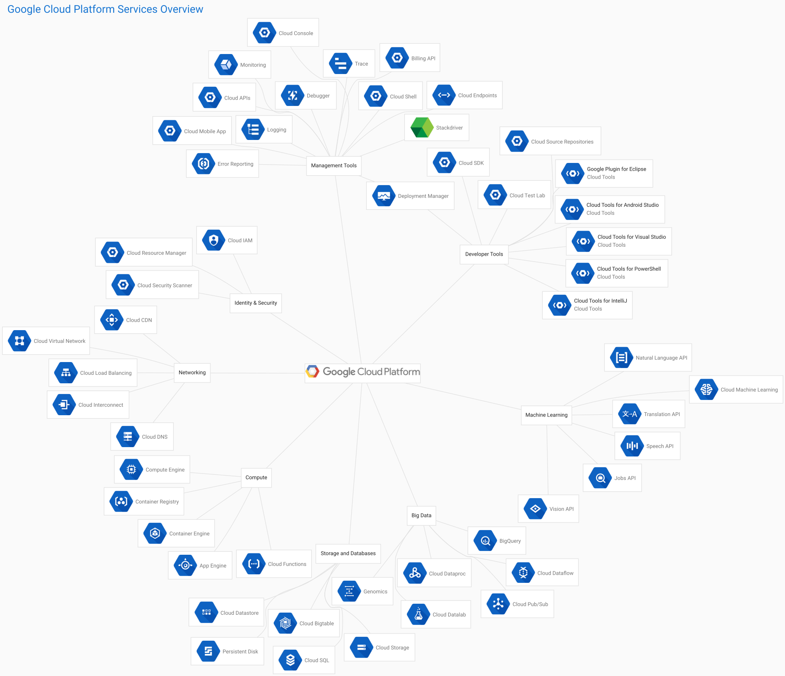

# gcp-graphviz
Google Cloud Platform services architecture visualization with Graphviz

## Dependencies
* [Graphviz](http://www.graphviz.org/)
* [GPP](http://www.nothingisreal.com/gpp/)
* [Inkscape](https://inkscape.org) (optional)

## Usage
```console
$ gpp my-graph.gv | dot -Tsvg -o my-graph.svg
$ inkscape --export-png=my-graph.png my-graph.svg # Optionally convert to png.
```

## Example
The result of the following commands:
```console
$ gpp GCP-Overview.gv | fdp -Tsvg -o GCP-Overview.svg
$ inkscape --export-png=GCP-Overview.png GCP-Overview.svg
```

